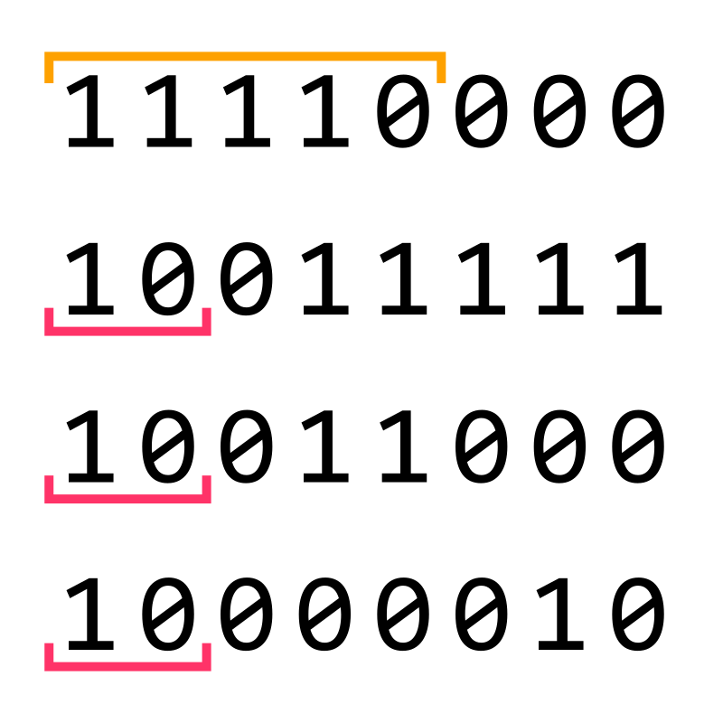

# Computer Laboratory, Cambridge

Observant visitors to the Computer Laboratory in Cambridge will notice an irregular and asymmetric pattern in the tiles of the floor of the main atrium, known as "The Street".
You can see some of these tiles [in photos of the inside of the building](https://www.flickr.com/photos/cambridgeuniversity/4171326989/in/album-72157622842733737/).
There are darker half-tiles, set in a grid of otherwise plain floor tiles.

If you spend a little more time and count the rows and columns, you’ll notice that the pattern is 39 columns long and at most 8 rows deep.
There are many tiles "missing" from a filled-in 39x8 arrangement, but it is clear that this is the outline. 39 is not a particularly special number in computer science, but $8 = 2^3$ is.
The presence or lack of a dark half-tile forms a bit, and the 8 bits in each row make up one byte.
It seems unlikely that thirty-nine 1-byte numbers have much significance by themselves; whatever message this is is almost certainly text in some encoding.
ASCII, a simple and pervasive text encoding in the Western world, is only a 7-bit encoding.
The Unicode encoding UTF-8, now the most popular text encoding, thus seems more likely.

It’s not clear which way round the floor is designed to be read, so to save time; read the bits from top-to-bottom and the bytes left-to-right when facing the interior courtyards.
All the diagrams below will be oriented this way up.
Looking at the floor, you’ll notice that the first 20 bytes are all 7 bits or less; they are in fact just ASCII, because UTF-8 was built to be backwards compatible in this way.

By the end of this page you should be able to decode the message yourself (and a diagram of the tile layout is provided below to save wandering round the building staring at the floor counting!), but we’ll start simpler with a single word.

## Example ASCII tiles

UTF-8 was designed to be backwards compatible with ASCII; since ASCII is simpler, and the first half of the real message looks to be ASCII characters too, this is a good place to start.

Consider the diagram above; there are 5 bytes, each corresponding to one ASCII character.
The first byte is $01001001_{2}$ or $73_{10}$ in the more-familiar decimal.
A quick [look at a table of ASCII values](https://isaaccomputerscience.org/concepts/data_rep_ascii_char_set) will show us that character $73$ is a capital letter "I".
The next byte is $01110011_{2}$ or $115_{10}$; this corresponds to a lowercase letter "s".
The next two bytes are the same: $01100001_{2}$ or $97_{10}$; the lowercase letter "a".
If you know how binary works, it’s clear that the last byte is 2 more than the previous one.
One of many nice tricks built into ASCII is that the alphabet appears consecutively in alphabetical order, which means that the last character is two letters after "a": a lowercase "c".

We’ve decoded an example to find the word "Isaac", and you can use this to decode the first 20 bytes of the real message. You might want to try doing that to start out.

Things get more complicated from there, because the message has some bytes that are definitely not ASCII; we need to learn how UTF-8 works to decode these.

## UTF-8

There are [good video explanations of UTF-8](https://www.youtube.com/watch?v=MijmeoH9LT4) on the Internet, and [the Wikipedia page has a great deal more information](https://en.wikipedia.org/wiki/UTF-8); but we’ll cover the very minimum you need to know to decode the floor tile message.

We’ll use another contrived example, this time the Oxford Dictionaries "Word of the Year" from 2015.

Unlike ASCII, UTF-8 is _not_ a fixed-length encoding; one character is allowed to be more than one byte long.
If the byte starts with a 0, then it’s a single byte character: this gives UTF-8 backwards-compatibility with ASCII.

The first byte here starts with two or more 1’s followed by a zero; this indicates that this is a UTF-8 multi-byte character.
The number of 1’s indicates how many bytes are in the character; 4 in this case. If it had started "1110...", then the character would contain three bytes.
Every other byte in this same character will start "10..." to show that it’s a continuation of a character (and for other technical reasons that the linked video explains).
This tells us that the example here is actually just one character long!

The diagram above shows the four bytes of this character, highlighting the initial indication this is a multi-byte character 4 bytes in length (the yellow overline) and showing the bits that mark the fact these bytes continue an existing character (the pink underlines).
Programs that read files one byte at a time can use these marks to find the start of a character.
The remaining bits, after these special bits are ignored, form a single large number: $000011111011000000010_{2}$.
It is this number that the Unicode consortium map to a specific visual character.
In this case the number is $128514_{10}$, but when talking about Unicode it is more common to use hexadecimal for the value.
You can [read about converting binary into hexadecimal](https://isaaccomputerscience.org/concepts/data_numbases_conversions#binarytohex), but this results in $\mathrm{1F602}_{16}$.
You can then [go to the Unicode website to look up U+1F602](https://unicode.org/cldr/utility/character.jsp?a=1F602) to find the name and shape of the character with that hexadecimal value; it is "FACE WITH TEARS OF JOY": 😂.

If there was another byte after this, it would either start "11..." and be part of a multi-byte character, or else start "0..." and be a single byte ASCII character.
This makes it easy to tell where one character ends and another begins.

## The Challenge

The message in The Street of the Computer Laboratory is 39 bytes long and reproduced in full below. Click the image for a larger version.

Can you decode it?
